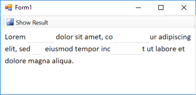
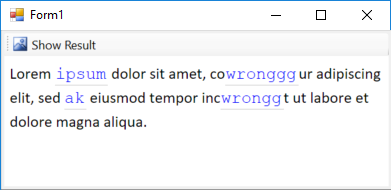
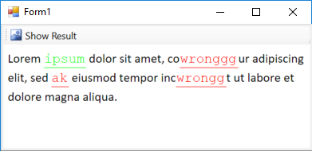

# Fill in the blank quiz

In this example, I've used WebBrowser control to show a render a friendly Fill in the blank quiz.

The base idea is creating an html output based on the quiz model (including the original text and ragnes of blanks) and rendering the model using html and showing it in a `WebBrowser` control.

To do so, I've created a `Quiz` model. The model is		uiet simple:

	public class Quiz
	{
		public Quiz() { Ranges = new List<SelectionRange>(); }
		public string Text { get; set; }
		public List<SelectionRange> Ranges { get; private set; }
		public string Render()
		{
			/* rendering logic*/
		}
	}

For example using following model:

    quiz = new Quiz();
    quiz.Text = @"Lorem ipsum dolor sit amet, consectetur adipiscing elit, sed do eiusmod tempor incididunt ut labore et dolore magna aliqua.";
    quiz.Ranges.Add(new SelectionRange(6, 5));
    quiz.Ranges.Add(new SelectionRange(30, 7));
    quiz.Ranges.Add(new SelectionRange(61, 2));
    quiz.Ranges.Add(new SelectionRange(82, 6));

It will render this output:

Then after the user entered values, it will show this way:

And at last, when you click on `Show Result` button, it will show the correct answers in green color, and wrong answers in red color:

**Code**

Here is the complete code of the `Quiz` class:

	namespace FillInTheBlankQuizSamle
	{
		public class Quiz
		{
			public Quiz() { Ranges = new List<SelectionRange>(); }
			public string Text { get; set; }
			public List<SelectionRange> Ranges { get; private set; }
			public string Render()
			{
				var content = new StringBuilder(Text);
				for (int i = Ranges.Count - 1; i >= 0; i--)
				{
					content.Remove(Ranges[i].Start, Ranges[i].Length);
					var length = Ranges[i].Length;
					var replacement = $@"<input id=""q{i}"" 
						type=""text"" class=""editable""
						maxlength=""{length}"" 
						style=""width: {length*1.162}ch;"" />";
					content.Insert(Ranges[i].Start, replacement);
				}
				var result = $@"
				<html>
				  <head>
					<meta http-equiv=""X-UA-Compatible"" content=""IE=11"" />
					
					
				  </head>
				  <body>
					

					{content}
					

				  </body>
				</html>
	";
				return result;
			}
		}

		public class SelectionRange
		{
			public SelectionRange(int start, int length)
			{
				Start = start;
				Length = length;
			}
			public int Start { get; set; }
			public int Length { get; set; }
		}
	}
